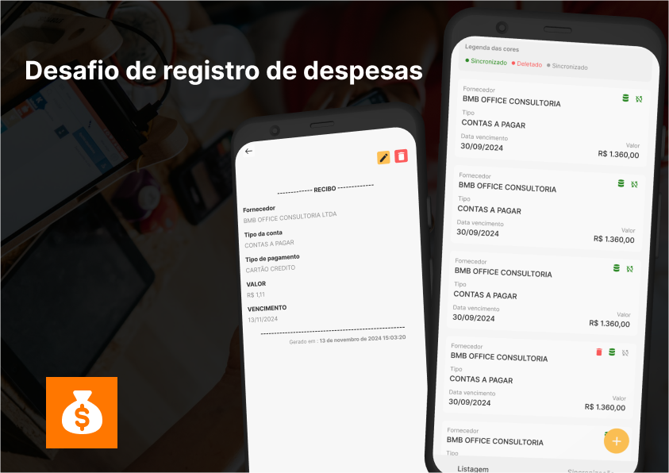

# 

O desafio consiste em mostrar o conhecimento em sincronização de dados online e offline, assim como deletar e atualizar as informações.
[Figma](https://www.figma.com/design/ulPqbVzlxDFhD4EypgyL3e/Sales?m=auto&t=crsHsVYIola8d2r9-1)

### Tecnologias necessárias para rodar o projeto:

| Ferramenta   | Versão                         |
| ------------ | ------------------------------ |
| NodeJS (LTS) | v21.7.1                        |
| react-native | 0.74.5                         |
| EXPO         | ~51.0.28                       |
| Java         | openjdk 17.0.12 2024-07-16 LTS |

### Foi utilizado expo na sua versão SDK 51 com as respectivas bibliotecas:

-   [x] Zustand - Para controlar o estado da modal de sincronização.
-   [x] NetInfo - Para identificar quando está conectado a uma rede ou dado móvel.
-   [x] HookForm - Para validar o formulário de cadastro e edição.
-   [x] expo-sqlite - Para criar um banco local para guardar as informações tanto online como offline.

### Melhorias do projeto futuras

-   [ ] Login no suparbase.
-   [ ] Listagem resgatando itens de cada usuário.
-   [ ] Notificação de sincronização em background.

## 🖥️Como utilizar projeto

```cm
git clone (link do repositório)
```

## Instale as dependências

```cm
yarn
```

## crie um .env na raiz do seu projeto

```cm
EXPO_PUBLIC_API_URL = sua credencial
EXPO_PUBLIC_API_KEY = sua credencial
```

## execute no android

```cm
yarn android
```

## execute no ios

```cm
cd ios && pod install && cd..
yarn ios
```

[Linkedin](https://www.linkedin.com/in/italoasouzati/)
